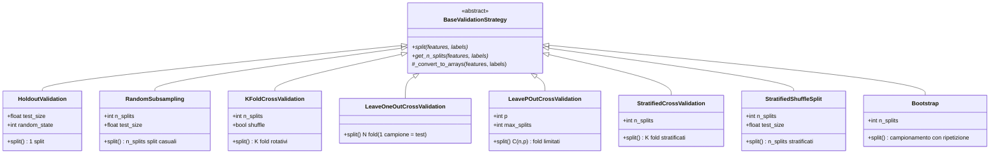

# Documentazione del Progetto — UCBM-FIA TumorClassify (Gruppo 3)

---

## Indice

1. [Introduzione — Cos'e questo progetto?](#1-introduzione--cose-questo-progetto)
2. [Il problema medico: tumori benigni e maligni](#2-il-problema-medico-tumori-benigni-e-maligni)
3. [L'idea alla base: come funziona il k-NN](#3-lidea-alla-base-come-funziona-il-k-nn)
4. [Architettura del progetto](#4-architettura-del-progetto)
5. [Flusso dei dati (Data Flow)](#5-flusso-dei-dati-data-flow)
6. [Caricamento e pulizia dei dati](#6-caricamento-e-pulizia-dei-dati)
7. [Il modello dei dati (OOP)](#7-il-modello-dei-dati-oop)
8. [Normalizzazione delle feature](#8-normalizzazione-delle-feature)
9. [L'algoritmo k-NN da zero](#9-lalgoritmo-k-nn-da-zero)
10. [Strategie di validazione](#10-strategie-di-validazione)
11. [Metriche di valutazione](#11-metriche-di-valutazione)
12. [Visualizzazione dei risultati](#12-visualizzazione-dei-risultati)
13. [Design Pattern utilizzati](#13-design-pattern-utilizzati)
14. [Interfaccia a riga di comando (CLI)](#14-interfaccia-a-riga-di-comando-cli)
15. [Infrastruttura: Docker, dipendenze, testing](#15-infrastruttura-docker-dipendenze-testing)
16. [Risultati ottenuti](#16-risultati-ottenuti)
17. [Glossario](#17-glossario)

---

## 1. Introduzione — Cos'e questo progetto?

### Per chi non e tecnico

Immagina di essere un medico: un paziente ti porta i risultati di una biopsia e tu devi decidere se il tumore e **benigno** (non pericoloso) o **maligno** (potenzialmente pericoloso). Hai a disposizione 9 misurazioni microscopiche delle cellule del tumore.

Questo progetto costruisce un "assistente digitale" che, basandosi su centinaia di casi gia diagnosticati, impara a riconoscere i pattern e suggerisce se un nuovo caso e benigno o maligno. Non sostituisce il medico, ma lo supporta.

### Per chi e tecnico

Si tratta di un classificatore binario basato sull'algoritmo **k-Nearest Neighbors (k-NN)**, implementato interamente **da zero** (senza scikit-learn) in Python. Il progetto e sviluppato per il corso di Fondamenti di Intelligenza Artificiale dell'UCBM (Gruppo 3) e classifica campioni del **Wisconsin Breast Cancer Dataset** in benigni (classe 2) o maligni (classe 4).

Il dataset assegnato al Gruppo 3 e il seguente:
- **A** (dataset): `breast-cancer-wisconsin.data` (Wisconsin Breast Cancer)
- **B** (strategia di validazione): Random Subsampling
- **C** (strategia di validazione): Leave-p-out Cross Validation

Oltre a queste, il progetto supporta anche Holdout, K-Fold, LOOCV, Stratified K-Fold, Stratified Shuffle Split e Bootstrap.

---

## 2. Il problema medico: tumori benigni e maligni

Il dataset proviene dal **Wisconsin Breast Cancer Database** raccolto dal Dr. William H. Wolberg presso l'Universita del Wisconsin. Ogni campione rappresenta un ago-aspirato (FNA) di una massa mammaria e contiene **9 caratteristiche citologiche** valutate su una scala da 1 a 10:

| # | Caratteristica | Cosa misura |
|---|----------------|-------------|
| 1 | Clump Thickness | Spessore degli agglomerati cellulari |
| 2 | Uniformity of Cell Size | Quanto sono uniformi le dimensioni delle cellule |
| 3 | Uniformity of Cell Shape | Quanto sono uniformi le forme delle cellule |
| 4 | Marginal Adhesion | Quanto le cellule aderiscono tra loro ai margini |
| 5 | Single Epithelial Cell Size | Dimensione delle cellule epiteliali singole |
| 6 | Bare Nuclei | Presenza di nuclei non circondati da citoplasma |
| 7 | Bland Chromatin | Aspetto della cromatina (materiale nel nucleo) |
| 8 | Normal Nucleoli | Aspetto dei nucleoli |
| 9 | Mitoses | Attivita mitotica (velocita di divisione cellulare) |

I tumori **maligni** tendono ad avere valori piu alti in queste misurazioni (cellule irregolari, nuclei esposti, alta proliferazione). I tumori **benigni** tendono a valori bassi e uniformi.

---

## 3. L'idea alla base: come funziona il k-NN

### Spiegazione intuitiva

Il k-NN funziona come la vita reale: se vuoi capire a che "categoria" appartiene qualcosa di nuovo, guardi le cose **piu simili** che gia conosci.

Esempio: un medico vede un nuovo campione. Cerca nei suoi archivi i **k** casi passati piu simili a quello nuovo (dove "simile" significa che i numeri delle 9 misurazioni sono vicini). Se la maggioranza di quei k casi erano maligni, conclude che anche il nuovo e probabilmente maligno.

### Spiegazione tecnica

L'algoritmo k-NN e un classificatore **instance-based** (o lazy learner): non costruisce un modello esplicito durante la fase di training, ma memorizza tutti i dati e rinvia il calcolo alla fase di predizione.

Per classificare un campione di test **x**:

1. **Calcola le distanze** tra **x** e tutti i campioni di training usando la distanza euclidea:

$$d(x, x_i) = \sqrt{\sum_{j=1}^{9} (x_j - x_{i,j})^2}$$

2. **Seleziona i k vicini piu prossimi** (quelli con distanza minore).

3. **Vota a maggioranza**: la classe piu frequente tra i k vicini diventa la predizione.

4. **Gestione dei pareggi**: se due classi hanno lo stesso numero di voti, la scelta e **casuale** (random tie-breaking), come richiesto dalla traccia.


---

## 4. Architettura del progetto

### Panoramica della struttura dei file

```
UCBM-FIA-TumorClassify-Group-3/
├── src/                          # Codice sorgente
│   ├── main.py                   # Entry point e logica CLI
│   ├── classifier/
│   │   └── knn_classifier.py     # Algoritmo k-NN
│   ├── evaluation/
│   │   └── strategies.py         # Strategie di validazione (Strategy + Factory)
│   ├── metrics/
│   │   └── metrics.py            # Metriche di valutazione
│   ├── model/
│   │   └── tumor_sample.py       # Modello dati OOP
│   ├── utils/
│   │   ├── data_loader.py        # Caricamento dati multi-formato (Factory)
│   │   └── preprocessing.py      # Normalizzazione feature
│   └── visualization/
│       └── plots.py              # Generazione grafici e salvataggio risultati
├── tests/                        # 188 test automatizzati
├── tests_data/                   # Dataset in 5 formati diversi
├── docs/                         # Documentazione
├── Dockerfile                    # Containerizzazione Docker
├── docker-compose.yml            # Orchestrazione Docker
└── requirements.txt              # Dipendenze Python
```

### Diagramma dei moduli e delle dipendenze


---

## 5. Flusso dei dati (Data Flow)

### Flusso completo end-to-end

Questo diagramma mostra il percorso dei dati dall'input alla visualizzazione finale, passando attraverso ogni fase del pipeline.


### Flusso della normalizzazione per-fold (prevenzione data leakage)

Un punto critico dell'implementazione e che la normalizzazione avviene **all'interno di ogni fold**, non sull'intero dataset. Questo previene il **data leakage** — la contaminazione del modello con informazioni dal test set.


> **Perche e importante?** Se normalizzassimo l'intero dataset prima dello split, i valori minimi e massimi del test set influenzerebbero la trasformazione dei dati di training. Il modello "vedrebbe" indirettamente informazioni sul test set, producendo stime di performance ingannevolmente ottimistiche. Con la normalizzazione per-fold, le stime sono realistiche e affidabili.

---

## 6. Caricamento e pulizia dei dati

### Come funziona il caricamento

Il sistema supporta **5 formati di file** diversi. Il `DataLoaderFactory` esamina l'estensione del file e crea automaticamente il loader appropriato:


### Pulizia automatica

I dataset forniti contengono diverse **anomalie intenzionali** che il sistema gestisce automaticamente:

| Anomalia | Come viene gestita |
|----------|-------------------|
| Nomi di colonne non standard (es. `clump_thickness_ty`, `uni!`, `mar!`) | Mappatura automatica tramite dizionario di varianti |
| Valori mancanti o `NaN` | Il campione viene scartato |
| Valori fuori range (non in 1-10) | Il campione viene scartato |
| Valori con virgola come separatore decimale (es. `3,5`) | Convertiti automaticamente (virgola → punto → arrotondamento) |
| Stringhe corrotte al posto di numeri | Il campione viene scartato |
| ID duplicati | Solo la prima occorrenza viene mantenuta |
| Classi testuali (`"benign"`, `"malignant"`, anche con typo `"maligant"`) | Convertite a 2 e 4 |
| Colonne posizionali (`col_0`, `col_1`, ...) | Rinominate nello standard |

---

## 7. Il modello dei dati (OOP)

Il progetto utilizza un modello a oggetti strutturato in tre livelli per rappresentare i dati:


- **`TumorFeatures`** — Un dataclass che incapsula le 9 feature citologiche. Valida automaticamente che ogni valore sia un intero tra 1 e 10. Supporta conversione da/verso array numpy e dizionari.

- **`TumorSample`** — Rappresenta un singolo campione con ID, features e classe (2 = benigno, 4 = maligno). Valida che la classe sia corretta.

- **`TumorDataset`** — Collezione di campioni con gestione automatica dei duplicati (tramite un set di ID). Offre metodi per filtraggio, partizionamento e conversione a array numpy per l'algoritmo ML.

---

## 8. Normalizzazione delle feature

### Perche normalizzare?

Le 9 feature hanno tutte range 1-10, ma nella pratica la distribuzione dei valori puo variare molto. La normalizzazione **min-max** trasforma ogni feature nell'intervallo [0, 1]:

$$x_{norm} = \frac{x - x_{min}}{x_{max} - x_{min}}$$

Senza normalizzazione, feature con valori mediamente piu alti dominerebbero il calcolo della distanza euclidea.

### Il pattern fit/transform

Il modulo `preprocessing.py` fornisce tre funzioni:

| Funzione | Scopo |
|----------|-------|
| `compute_normalization_params(features)` | Calcola min e max **per feature** — da chiamare solo sui dati di training |
| `apply_normalization(features, min_vals, max_vals)` | Applica la trasformazione usando i parametri pre-calcolati |
| `normalize_features(features)` | Funzione di comodo che fa entrambe le operazioni (per test/utility) |

> **Nota**: i valori di test normalizzati con i parametri del training possono uscire dall'intervallo [0, 1]. Questo e matematicamente corretto e non causa problemi per il k-NN, che lavora su distanze euclidee e non richiede valori limitati.

---

## 9. L'algoritmo k-NN da zero

### Implementazione nel dettaglio

La classe `KNNClassifier` implementa l'intero algoritmo senza usare librerie di machine learning esterne:


### Probabilita e confidenza

Oltre alla predizione secca (classe 2 o 4), il classificatore calcola anche le **probabilita**:

$$P(\text{classe} = c) = \frac{\text{numero di vicini con classe } c}{k}$$

Ad esempio, con k=5, se 3 vicini sono maligni e 2 benigni, le probabilita sono: `[0.4, 0.6]` (40% benigno, 60% maligno). Queste probabilita sono fondamentali per il calcolo della curva ROC e dell'AUC.

---

## 10. Strategie di validazione

### Cos'e la validazione e perche serve

Per capire se il nostro classificatore funziona bene, non possiamo valutarlo sugli stessi dati con cui lo abbiamo addestrato (sarebbe come fare un esame sapendo gia le risposte). Dobbiamo **dividere i dati** in una parte per l'addestramento e una parte per il test.

Le diverse strategie di validazione offrono modi diversi di effettuare questa divisione, ciascuno con vantaggi e svantaggi.

### Gerarchia delle classi (Strategy Pattern)



### Descrizione di ogni strategia

#### Holdout (Split singolo)
Divide il dataset una sola volta: una parte per il training, una per il test. E la strategia piu semplice e veloce.

```
Dati: [████████████████████████████████████████]
       [████████ Training (70%) ████████][Test 30%]
```

#### Random Subsampling (strategia B del Gruppo 3)
Come l'holdout, ma ripetuto K volte con split casuali diversi. Riduce la variabilita dando una stima piu stabile.

```
Split 1: [Training ████████████████████][Test █████]
Split 2: [█████ Test ████][Training █████████████████]
Split 3: [Training ██████████████][Test ████][Train ██]
...ripetuto K volte
```

#### K-Fold Cross Validation
Divide i dati in K parti uguali. A turno, ogni parte viene usata come test e le altre K-1 come training. Ogni campione viene testato esattamente una volta.

```
Fold 1: [Test ███][Train ████████████████████████████]
Fold 2: [Train ███][Test ███][Train ████████████████████]
Fold 3: [Train ███████][Test ███][Train ██████████████████]
Fold 4: [Train ████████████][Test ███][Train ████████████]
Fold 5: [Train ████████████████████████████][Test ███]
```

#### Leave-One-Out Cross Validation (LOOCV)
Caso estremo del K-Fold dove K = N (numero totale di campioni). Ogni campione viene testato singolarmente. Molto lento ma utilizza quasi tutti i dati per il training.

#### Leave-p-Out Cross Validation (strategia C del Gruppo 3)
Come LOOCV, ma si lasciano fuori **p** campioni alla volta per il test. Il numero totale di combinazioni C(n,p) puo essere enorme, quindi il sistema limita il numero di split con un parametro `max_splits`.

#### Stratified K-Fold
Come K-Fold, ma garantisce che ogni fold abbia la stessa proporzione di classi (benigni/maligni) dell'intero dataset. Utile quando le classi sono sbilanciate.

#### Stratified Shuffle Split
Combina Random Subsampling e stratificazione: split casuali ripetuti che mantengono le proporzioni delle classi.

#### Bootstrap
Il training set viene creato campionando **con rimpiazzo** (lo stesso campione puo apparire piu volte). I campioni non estratti (out-of-bag) formano il test set.

---

## 11. Metriche di valutazione

### Per chi non e tecnico

Dopo che il modello ha fatto le sue predizioni, dobbiamo capire **quanto bene ha funzionato**. Ci sono diversi modi per misurarlo, ognuno che ci dice qualcosa di diverso:

- **Accuracy (Accuratezza)**: su 100 predizioni, quante sono state corrette? (es. 97 su 100 = 97%)
- **Error Rate (Tasso di errore)**: quante predizioni sono state sbagliate? (complementare dell'accuracy)
- **Sensitivity (Sensibilita)**: dei tumori maligni veri, quanti li ha riconosciuti? (importante: non vogliamo mancare un tumore maligno!)
- **Specificity (Specificita)**: dei tumori benigni veri, quanti li ha riconosciuti correttamente?
- **AUC**: un punteggio globale della bonta del modello (1.0 = perfetto, 0.5 = come tirare una moneta)

### Per chi e tecnico

Tutte le metriche partono dalla **matrice di confusione**:

|  | Predetto Benigno (2) | Predetto Maligno (4) |
|---|---|---|
| **Vero Benigno (2)** | TN (Veri Negativi) | FP (Falsi Positivi) |
| **Vero Maligno (4)** | FN (Falsi Negativi) | TP (Veri Positivi) |

Le formule implementate:

| Metrica | Formula | Interpretazione |
|---------|---------|-----------------|
| Accuracy | (TP + TN) / (TP + TN + FP + FN) | Proporzione di predizioni corrette |
| Error Rate | 1 - Accuracy | Proporzione di errori |
| Sensitivity (Recall) | TP / (TP + FN) | Capacita di trovare i maligni |
| Specificity | TN / (TN + FP) | Capacita di riconoscere i benigni |
| Geometric Mean | sqrt(Sensitivity * Specificity) | Media bilanciata |
| AUC | Area sotto la curva ROC (regola del trapezio) | Capacita discriminativa globale |

### Calcolo dell'AUC

L'AUC (Area Under the ROC Curve) viene calcolata da zero con la **regola del trapezio**:

1. Si ordinano i campioni per probabilita predetta decrescente
2. Si traccia la curva ROC incrementando TPR e FPR
3. Si somma l'area dei trapezi sotto la curva

$$AUC = \sum_{i=1}^{n} \frac{(FPR_i - FPR_{i-1}) \cdot (TPR_i + TPR_{i-1})}{2}$$

---

## 12. Visualizzazione dei risultati

Il modulo `visualization/plots.py` genera automaticamente i seguenti grafici:

| Grafico | File generato | Cosa mostra |
|---------|--------------|-------------|
| Matrice di confusione | `*_confusion_matrix.png` | Heatmap con TN, FP, FN, TP |
| Curva ROC | `*_roc_curve.png` | TPR vs FPR con linea del classificatore casuale |
| Confronto metriche | `*_metrics_comparison.png` | Barre colorate per le 5 metriche principali |
| Distribuzione accuracy | `*_accuracy_distribution.png` | Boxplot dell'accuracy tra i vari fold |
| Accuracy vs k | `accuracy_vs_k.png` | Andamento dell'accuracy al variare di k |
| Error rate vs k | `error_rate_vs_k.png` | Andamento dell'errore al variare di k |

I risultati vengono anche salvati in formato CSV e XLSX per analisi ulteriori.

---

## 13. Design Pattern utilizzati

Il progetto adotta due design pattern fondamentali, come richiesto dalla traccia.

### Strategy Pattern

Il **Strategy Pattern** permette di intercambiare le strategie di validazione senza modificare il codice che le usa. Tutte le strategie implementano la stessa interfaccia (`BaseValidationStrategy` con i metodi `split` e `get_n_splits`), quindi il codice di valutazione non ha bisogno di sapere quale strategia specifica sta usando.


**Vantaggio**: per aggiungere una nuova strategia basta creare una nuova classe che estende `BaseValidationStrategy`, senza toccare nessun altro file.

### Factory Pattern

Il **Factory Pattern** viene usato in due punti per creare oggetti senza esporre la logica di istanziazione:

1. **`DataLoaderFactory`** — Dato un filepath, rileva l'estensione e crea il loader corretto (CSV, TXT, JSON, XLSX, TSV).

2. **`ValidationStrategyFactory`** — Data una stringa (es. `"kfold"`), crea l'oggetto strategia corrispondente con i parametri configurati.


---

## 14. Interfaccia a riga di comando (CLI)

L'applicazione si controlla interamente da terminale tramite `argparse`. Ecco i parametri disponibili:

### Parametri principali

| Parametro | Default | Descrizione |
|-----------|---------|-------------|
| `--data, -d` | auto-detect | Percorso al file dati |
| `--k` | 3 | Numero di vicini per k-NN |
| `--k-values` | — | Lista di k da confrontare (es. `"1,3,5,7,9"`) |
| `--strategy, -s` | `holdout` | Strategia di validazione |
| `--K` | 5 | Numero di fold/split/iterazioni |
| `--test-size` | 0.3 | Proporzione del test set |
| `--p` | 2 | Parametro p per Leave-p-out |
| `--metrics, -m` | `all` | Metriche da calcolare |
| `--output-dir, -o` | `results` | Cartella di output |
| `--random-state` | 42 | Seed per riproducibilita |
| `--verbose, -v` | off | Output dettagliato |
| `--no-plots` | off | Disabilita generazione grafici |
| `--no-subfolder` | off | Salva direttamente nella cartella output |
| `--aliases` | — | Mappatura nomi colonne personalizzati |

### Esempi di utilizzo

```bash
# Valutazione base con Holdout
python -m src.main --data tests_data/version_1.csv --k 5 --strategy holdout --test-size 0.3

# Random Subsampling (strategia B) con 10 iterazioni
python -m src.main --data tests_data/version_1.csv --k 3 --strategy random_subsampling --K 10

# Leave-p-out (strategia C) con p=2 e massimo 100 split
python -m src.main --data tests_data/version_1.csv --k 3 --strategy lpocv --p 2 --K 100

# Confronto di diversi valori di k
python -m src.main --data tests_data/version_1.csv --k-values "1,3,5,7,9,11" --strategy kfold --K 10

# Solo accuracy e AUC, senza grafici
python -m src.main --data tests_data/version_1.csv --k 5 --metrics accuracy auc --no-plots
```

### Diagramma del flusso decisionale di main()


---

## 15. Infrastruttura: Docker, dipendenze, testing

### Dipendenze

Il progetto utilizza **solo le librerie consentite** dalla traccia:

| Libreria | Versione | Utilizzo |
|----------|----------|----------|
| `numpy` | >= 1.24.0 | Operazioni numeriche, array, calcolo distanze |
| `pandas` | >= 2.0.0 | Caricamento dati da file |
| `matplotlib` | >= 3.7.0 | Generazione grafici |
| `openpyxl` | >= 3.1.0 | Supporto file Excel (.xlsx) |

### Docker

Il progetto include un `Dockerfile` e un `docker-compose.yml` per eseguire l'applicazione in un container isolato:

```bash
# Build e avvio con Docker Compose
docker-compose up --build

# Oppure manualmente
docker build -t ucbm-fia-tumorclassify-group-3 .
docker run -v $(pwd)/data:/app/data -v $(pwd)/results:/app/results \
  ucbm-fia-tumorclassify-group-3 \
  python -m src.main --data data/version_1.csv --k 5 --strategy kfold --K 5
```

### Testing

Il progetto include **188 test automatizzati** organizzati in 10 file di test, tutti basati su `unittest`:

| File di test | Cosa testa | N. test |
|-------------|------------|---------|
| `test_classifier.py` | k-NN: inizializzazione, fit, predict, distanze, edge cases | 12 |
| `test_data_loader.py` | Loader factory, pulizia valori, caricamento formati | 20 |
| `test_preprocessing.py` | Normalizzazione: convenience e fit/transform | 11 |
| `test_metrics.py` | Tutte le 6 metriche + confusion matrix | 16 |
| `test_validation_strategies.py` | Tutte le 8 strategie + factory | 15 |
| `test_main.py` | CLI: parsing, alias, loading, evaluation, saving | 25 |
| `test_integration.py` | Pipeline completo su file reali | 8 |
| `test_edge_cases.py` | Casi limite, divisione per zero, dati invalidi | 20 |
| `test_visualization.py` | Grafici, salvataggio file, directory output | 25 |
| `test.py` | Test base sugli split delle strategie | 2 |

Esecuzione:

```bash
python -m unittest discover tests -v
```

---

## 16. Risultati ottenuti

### Performance su tutti i dataset

| Dataset | Formato | Accuracy |
|---------|---------|----------|
| version_1.csv | CSV | 98.75% |
| version_2.xlsx | Excel | 93.69% |
| version_3.txt | TXT | 97.06% |
| version_4.json | JSON | 98.32% |
| version_5.tsv | TSV | 97.03% |

> Valori ottenuti con Holdout (70/30), k=3, random_state=42, normalizzazione per-fold.

### K-Fold Cross Validation (k=5, 5 fold)

| Metrica | Media | Dev. Std. |
|---------|-------|-----------|
| Accuracy | 0.9683 | 0.0140 |
| Error Rate | 0.0317 | 0.0140 |
| Sensitivity | 0.9529 | 0.0292 |
| Specificity | 0.9748 | 0.0190 |
| Geometric Mean | 0.9636 | 0.0166 |
| AUC | 0.9902 | 0.0084 |

Matrice di confusione aggregata:
- Veri Negativi (TN): 339
- Falsi Positivi (FP): 9
- Falsi Negativi (FN): 8
- Veri Positivi (TP): 180

**Interpretazione**: il classificatore raggiunge un'accuracy media del **96.8%** con una AUC di **0.99**, dimostrando un'eccellente capacita discriminativa tra tumori benigni e maligni. La sensitivity del 95.3% indica che il modello identifica correttamente la grande maggioranza dei tumori maligni, un aspetto critico in ambito medico.

---

## 17. Glossario

| Termine | Significato |
|---------|-------------|
| **k-NN** | k-Nearest Neighbors — algoritmo che classifica in base ai vicini piu simili |
| **Feature** | Caratteristica misurabile di un campione (es. spessore degli agglomerati) |
| **Label** | Etichetta di classe: benigno (2) o maligno (4) |
| **Training set** | Dati usati per "addestrare" il modello |
| **Test set** | Dati usati per valutare le prestazioni del modello |
| **Fold** | Una singola iterazione di split train/test nella cross-validation |
| **Cross-validation** | Tecnica di valutazione che divide i dati in piu fold |
| **Data leakage** | Contaminazione del training con informazioni del test set |
| **Normalizzazione** | Trasformazione dei valori in un range uniforme (es. [0, 1]) |
| **Distanza euclidea** | Misura della "distanza" geometrica tra due punti nello spazio delle feature |
| **Confusion matrix** | Tabella che riassume predizioni corrette ed errate |
| **Accuracy** | Percentuale di predizioni corrette sul totale |
| **Sensitivity** | Capacita di identificare i positivi (maligni) |
| **Specificity** | Capacita di identificare i negativi (benigni) |
| **AUC** | Area sotto la curva ROC — misura globale della qualita del modello |
| **ROC Curve** | Grafico che mostra il trade-off tra sensibilita e falsi positivi |
| **Strategy Pattern** | Design pattern che permette di scambiare algoritmi in modo intercambiabile |
| **Factory Pattern** | Design pattern che centralizza la creazione di oggetti |
| **OOP** | Programmazione orientata agli oggetti |
| **CLI** | Interfaccia a riga di comando |

---

*Documentazione generata per il progetto UCBM-FIA TumorClassify — Gruppo 3*
*Corso di Fondamenti di Intelligenza Artificiale — UCBM*
